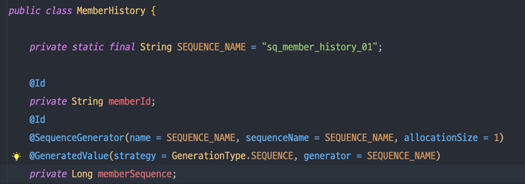
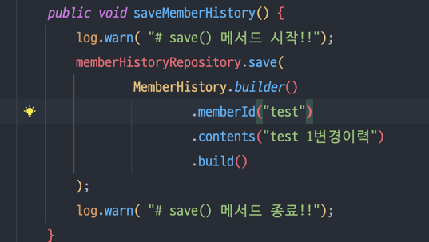
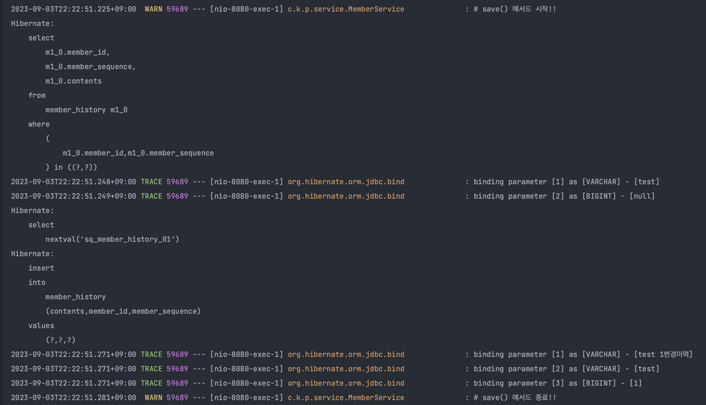

### 1. MemberHisory 엔터티에 복합컬럼PK를 두고, 시퀀스컬럼에 @SequenceGenerator, @GeneratedValue 정의

### 2. MemberService에서 save() 메서드만 호출

### 3. 어플리케이션 로그에 save()시 select -> nextval -> insert순으로 쿼리 수행됨
- nextval 쿼리 자동으로 실행 및 컬럼에 셋팅해줌

### 4. 실제 테스트
1. docker-compose 실행
2. application 실행
3. http 폴더에 있는 http 파일 실행